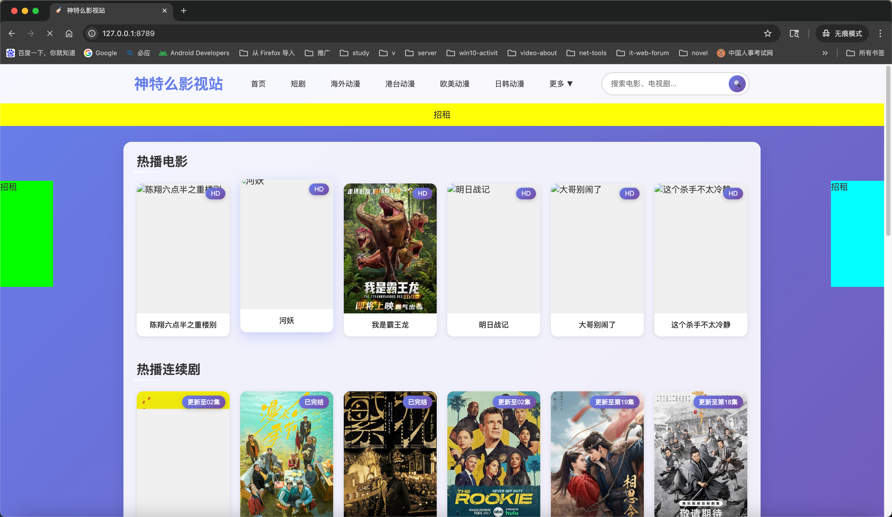
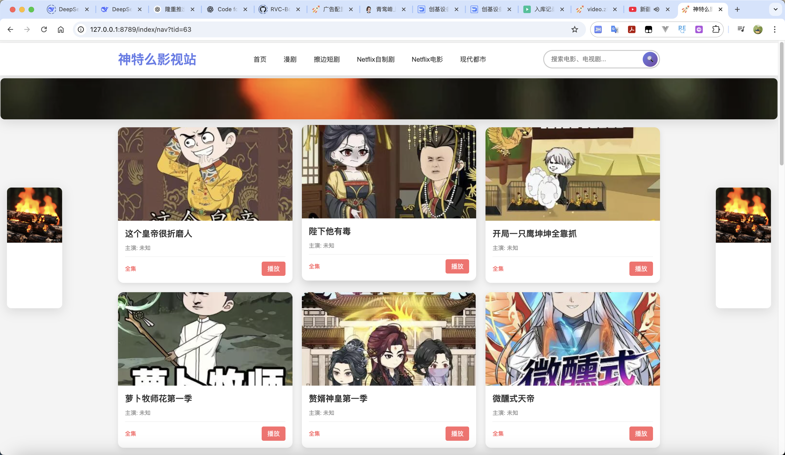
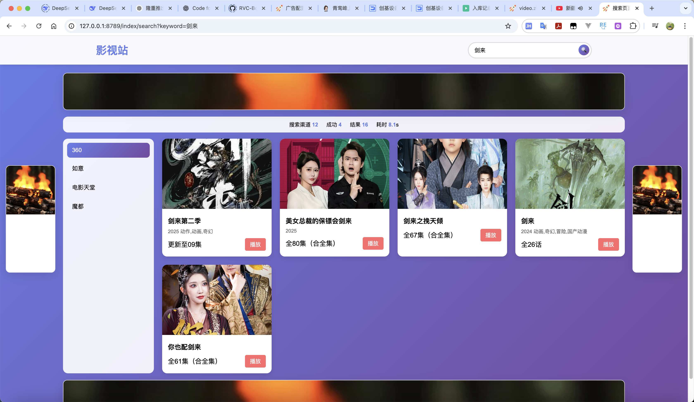
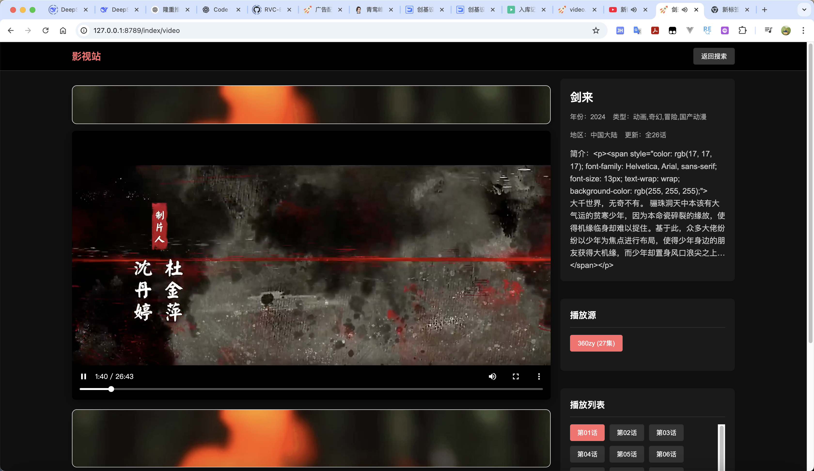
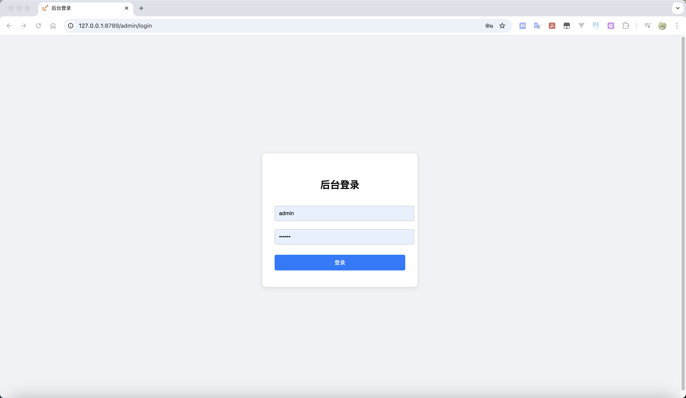
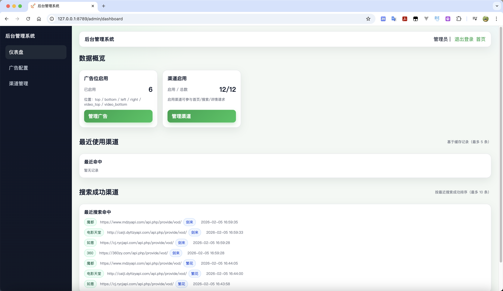
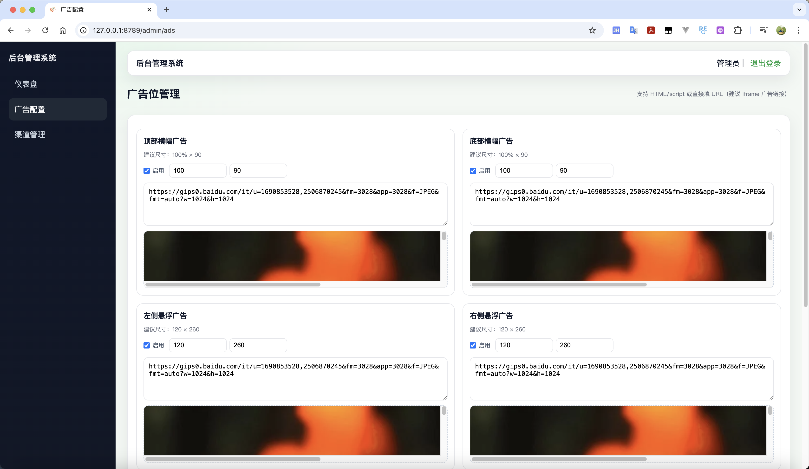
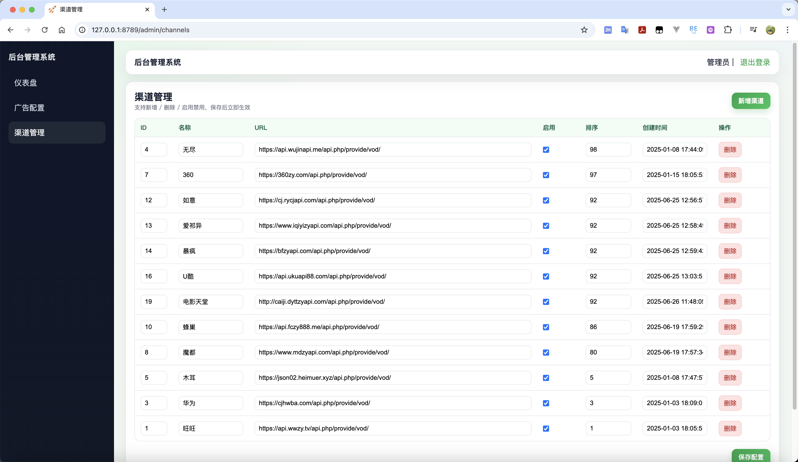

# 影视站 (video-web)










基于 [webman](https://www.workerman.net/webman) + [Workerman](https://www.workerman.net) 的影视聚合站，支持多视频源/多渠道、搜索、HLS 播放与 M3U8 代理，带简单后台与广告位配置。
## 技术栈

| 类型 | 技术 |
|------|------|
| 框架 | webman (PHP 8.1+) |
| 模板 | topthink/think-template |
| 缓存 | webman/cache |
| 日志 | monolog |

---

## 功能模块

### 一、前台

| 功能 | 说明 | 入口/路由 |
|------|------|-----------|
| **首页** | 站点名、Logo、导航分类、推荐位、搜索框；支持顶部/底部/左右/视频底部等广告位（由 `runtime/ads.json` 控制） | `GET /` |
| **分类列表** | 按 `tid` 展示某分类下的视频列表（封面、名称、主演、备注等） | `GET /index/nav?tid={type_id}` |
| **搜索** | 多渠道并发搜索，按关键词聚合结果；支持渠道切换、点击跳转播放 | `GET /index/search?keyword=xxx` |
| **视频播放** | HLS（M3U8）播放：多播放源、多选集、自动/手动播放、缓冲/错误/重试；播放器**顶部广告位**由 `IndexController::getPlayerAdConfig()` 控制 | `POST /index/video` 或 `GET /index/video?ids=xx&channel_url=xx` |
| **M3U8 代理 (vproxy)** | 代理 M3U8 与 TS 请求，解决跨域与相对路径；自动将 M3U8 内相对路径改写为经本站代理的地址 | `GET /index/vproxy?url=xxx` |
| **通用 API 代理 (proxy)** | 转发任意 JSON 接口，用于前端跨域请求 | `GET /index/proxy?url=xxx` |

### 二、后台  --- 不要了 要什么后台 直接写死配置完事

| 功能 | 说明 | 入口/路由 |
|------|------|-----------|
| **登录** | 账号密码登录，Session 维持（默认 `admin` / `123456`，见 `AdminController`） | `GET/POST /admin/login` |
| **仪表盘** | 后台首页 | `GET /admin/dashboard` |
| **广告配置** | 配置顶部、底部、左侧、右侧、视频播放器**底部**广告（HTML/script），写入 `runtime/ads.json` | `GET/POST /admin/ads` |
| **退出** | 清除 Session 并跳转登录 | `GET /admin/logout` |

> 说明：**播放器内顶部广告** 与后台「广告配置」不同，由 `IndexController::getPlayerAdConfig()` 的 `enabled`、`html` 控制，在 `IndexController` 中修改即可。

### 三、公共与基础设施

| 模块 | 说明 |
|------|------|
| **视频渠道 (VideoUtils)** | 多数据源：渠道列表、可用渠道探测、分类导航、分类下视频列表、视频详情；`getNav` 含分类黑名单过滤 |
| **缓存** | 可用渠道、分类导航等使用 `Cache`，减少对上游 API 的请求 |
| **日志 (VideoLogUtils)** | `info`、`warning` 等，用于请求、解析、代理、错误排查 |
| **M3U8 解析** | 播放源仅保留 M3U8；`parsePlaySources` 过滤非 M3U8，解析 `vod_play_from` / `vod_play_url` |

---

## 路由一览

| 方法 | 路径 | 控制器方法 |
|------|------|------------|
| GET | `/` | `IndexController::index` |
| GET | `/index/nav` | `IndexController::nav` |
| GET | `/index/search` | `IndexController::search` |
| GET / POST | `/index/video` | `IndexController::video` |
| GET | `/index/vproxy` | `IndexController::vproxy` |
| GET | `/index/proxy` | `IndexController::proxy` |
| GET | `/admin/login` | `AdminController::loginPage` |
| POST | `/admin/login` | `AdminController::doLogin` |
| GET | `/admin/dashboard` | `AdminController::dashboard` |
| GET | `/admin/ads` | `AdminController::adsPage` |
| POST | `/admin/ads` | `AdminController::saveAds` |
| GET | `/admin/logout` | `AdminController::logout` |

> `/index/*` 若未在 `config/route.php` 显式注册，依赖 webman 默认的 `/{controller}/{action}` 解析到 `IndexController`。

---

## 目录结构（精简）

```
video-web/
├── app/
│   ├── controller/
│   │   ├── IndexController.php   # 首页、分类、搜索、播放、vproxy、proxy、播放器顶部广告配置
│   │   └── AdminController.php   # 登录、仪表盘、广告配置(ads.json)、登出
│   ├── view/
│   │   ├── index/                # index, nav, search, video
│   │   └── admin/                # login, dashboard, ads
│   └── middleware/
├── common/
│   ├── VideoUtils.php            # 渠道、导航、列表、详情、缓存、黑名单
│   └── VideoLogUtils.php         # 日志
├── config/                       # app, route, cache, view, server 等
├── public/                       # 静态资源、favicon、ads 相关
├── runtime/                      # ads.json、日志、缓存等（可写）
├── start.php                     # 启动入口
├── windows.php / windows.bat     # Windows 下启动
└── composer.json
```

---

## 安装与运行

### 环境

- PHP >= 8.1
- 建议开启 `ext-event` 以提升性能

### 安装

```bash
composer install
```

### 启动

**Linux / macOS：**

```bash
php start.php start
```

**Windows：**

```bash
windows.bat
# 或
php windows.php
```

### 本地启动访问

- 前台：`http://127.0.0.1:8789/`（端口以 `config/process.php` 中实际监听端口为准）
- 后台：`http://127.0.0.1:8789/admin/login`

---

## 配置与扩展

| 项目 | 位置 | 说明 |
|------|------|------|
| 站点名 / Logo | `common/VideoUtils::systemName()`、`systemLogo()` | 直接改返回值 |
| 渠道列表 | `common/VideoUtils::channels()` | 返回 JSON，可按需改为数据库或配置文件 |
| 分类黑名单 | `common/VideoUtils::blacklist()` | 过滤 `getNav` 中的分类 |
| 首页推荐 | `IndexController::mainReJson()` | 静态 JSON，可改为接口或数据库，目前没必要，自己维护一套首页json即可 |
| 播放器顶部广告 | `IndexController::getPlayerAdConfig()` | `enabled` 控制显隐，`html` 为广告 HTML |
| 整站广告位 | 后台「广告配置」→ `runtime/ads.json` | 顶部/底部/左右/播放器顶部/播放器底部 |
| 后台账号 | `AdminController::$username`、`$password` | 建议改为配置或数据库 |

---

## 广告后台使用手册

### 入口
1. 启动服务后访问：`http://127.0.0.1:8789/admin/login`
2. 默认账号密码：`admin / 123456`
3. 登录后进入「广告配置」

### 广告配置说明
后台每个广告位都有：
- **启用开关**：关闭则该广告位不渲染
- **宽/高**：单位 px；顶部/底部可留空宽度表示 100%
- **内容**：可填 **URL** 或 **HTML/script**

### 填写规则
- **URL**：直接填广告落地页/素材页地址，系统用 `iframe` 加载
- **HTML/script**：支持第三方广告脚本，系统用 `iframe` 的 `srcdoc` 渲染
- **预览**：填写内容后会实时在后台预览

### 广告位与建议尺寸
| 位置 | 字段 | 建议尺寸 |
|------|------|----------|
| 顶部横幅 | top | 100% × 90 |
| 底部横幅 | bottom | 100% × 90 |
| 左侧悬浮 | left | 120 × 260 |
| 右侧悬浮 | right | 120 × 260 |
| 播放器顶部 | video_top | 100% × 80 |
| 播放器底部 | video_bottom | 100% × 120 |

### 数据存储
配置保存到：`runtime/ads.json`  
结构示例（节选）：
```json
{
  "top": { "enabled": true, "content": "https://example.com/ad.html", "width": 0, "height": 90 },
  "left": { "enabled": false, "content": "", "width": 120, "height": 260 }
}
```

### 前台展示
前台页面会加载 `/ads/ads.js` 自动渲染广告位，默认使用 `iframe` 展示。

---

## 依赖

- workerman/webman-framework ^2.1
- webman/cache 2.1.2
- topthink/think-template ^3.0
- monolog/monolog ^2.0

---

## 许可证

MIT（见 [LICENSE](LICENSE)）。
